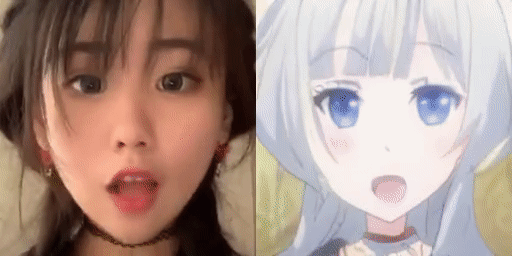
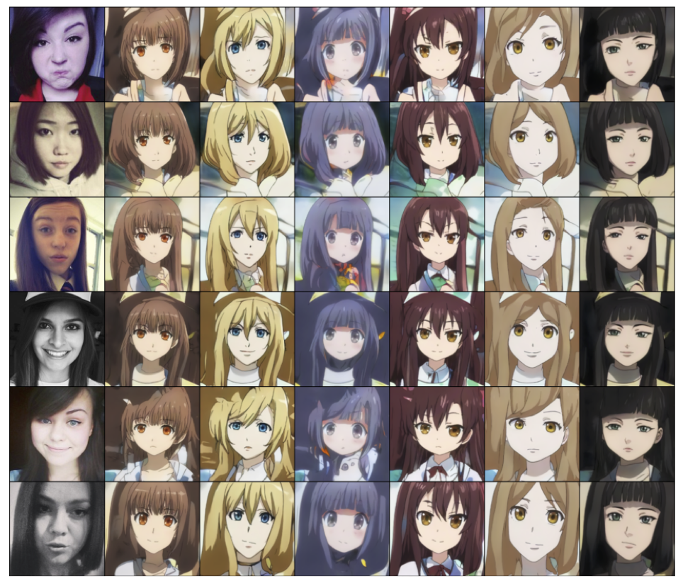

# GANs N' Roses Pytorch




[](https://colab.research.google.com/github/mchong6/GANsNRoses/blob/main/inference_colab.ipynb)
This is the PyTorch implementation of [GANs N’ Roses: Stable, Controllable, Diverse Image to Image Translation (works for videos too!)](https://arxiv.org/abs/2106.06561).

>**Abstract:**<br>
>We show how to learn a map that takes a content code, derived from a face image, and a randomly chosen style code to an anime image. We derive an adversarial loss from our simple and effective definitions of style and content. This adversarial loss guarantees the map is diverse -- a very wide range of anime can be produced from a single content code. Under plausible assumptions, the map is not just diverse, but also correctly represents the probability of an anime, conditioned on an input face. In contrast, current multimodal generation procedures cannot capture the complex styles that appear in anime.  Extensive quantitative experiments support the idea the map is correct. Extensive qualitative results show that the method can generate a much more diverse range of styles than SOTA comparisons. Finally, we show that our formalization of content and style allows us to perform video to video translation without ever training on videos.

[Demo and Docker image on Replicate](https://replicate.com/mchong6/gans-n-roses)
<a href="https://replicate.com/mchong6/gans-n-roses"></a>


[Gradio Web Demo](https://gradio.app/hub/AK391/GANsNRoses)


## What's New
**6/20** You can now easily upload your own images on colab.

## Dependency
```bash
conda install --yes -c pytorch pytorch=1.7.1 torchvision cudatoolkit=<CUDA_VERSION>
pip install tqdm gdown kornia scipy opencv-python dlib moviepy lpips aubio ninja
```

## Dataset
The dataset we use for training is the [selfie2anime](https://drive.google.com/file/d/1xOWj1UVgp6NKMT3HbPhBbtq2A4EDkghF/view?usp=sharing) dataset from UGATIT. You can also use your own dataset in the following format.
```
└── YOUR_DATASET_NAME
   ├── trainA
       ├── xxx.jpg (name, format doesn't matter)
       ├── yyy.png
       └── ...
   ├── trainB
       ├── zzz.jpg
       ├── www.png
       └── ...
   ├── testA
       ├── aaa.jpg 
       ├── bbb.png
       └── ...
   └── testB
       ├── ccc.jpg 
       ├── ddd.png
       └── ...
```

## Training
For training you might want to switch to train branch in order to use custom cuda kernel codes. Otherwise, it will use the Pytorch native implementation.
```bash
python train.py --name EXP_NAME --d_path YOUR_DATASET_NAME --batch BATCH_SIZE
```

The full model checkpoint is [here](https://drive.google.com/file/d/1xdjoTp0oRAXZpixYQmmQ-5rlXV36bSq-/view?usp=sharing) if you wish to you it for finetuning etc.

## Inference
Our notebook provides a comprehensive demo of both image and video translation. Pretrained model is automatically downloaded. As of now only female translation works well since the dataset only contains females. A more comprehensive dataset is needed to enable male translation too.


## Citation
If you use this code or ideas from our paper, please cite our paper:
```
@misc{chong2021gans,
      title={GANs N' Roses: Stable, Controllable, Diverse Image to Image Translation (works for videos too!)}, 
      author={Min Jin Chong and David Forsyth},
      year={2021},
      eprint={2106.06561},
      archivePrefix={arXiv},
      primaryClass={cs.CV}
}
```

## Acknowledgments
This code borrows heavily from [StyleGAN2 by rosalinity](https://github.com/rosinality/stylegan2-pytorch) and partly from [UGATIT](https://github.com/znxlwm/UGATIT-pytorch).
